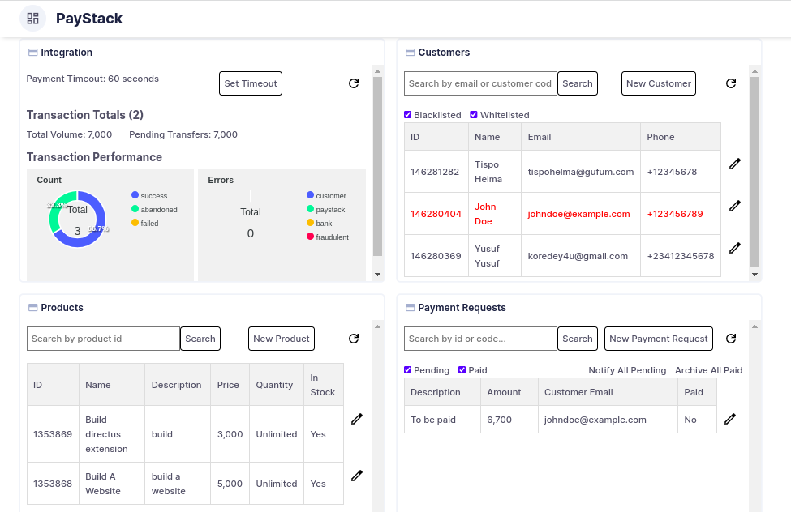

# StackSync

Syncing your Paystack integration seamlessly with your Directus project.

## Details

StackSync simplifies managing your Paystack integration within your Directus application. It allows you to handle tasks such as customer management, product management, and payment requests directly from your Directus application, minimizing the need for excessive page navigations. All you need to do is create the required panel screens, and you're good to go!

This extension utilizes the Paystack API, which you can access with your API keys (test or live keys) from your Paystack integration dashboard.

StackSync is a Directus bundle type extension, incorporating an endpoint extension for making requests to the Paystack API and a panel extension that provides the user interface for seamless interaction.

Excited about the future developments too! Planning to implement features such as real-time updates and additional integrations with Paystack APIs to enhance user experience.

## Set Up Instructions

1.  Obtain your Paystack API keys from your Paystack integration dashboard. A test key is provided by default, but you can also obtain a live key if you're ready to go live. Add this key to the dockerfile and your integration currency as environment variables. For example:

```yaml
environment:
  PAYSTACK_SECRET_KEY: 'sk_test_YourAPIKey'
  PAYSTACK_INTEGRATION_CURRENCY: 'CurrencyCode' # e.g. NGN, USD, GHS, etc.
```

2. Clone this repository into your extensions folder.

```bash
git clone https://github.com/koredeycode/StackSync.git
```

3. Rename the folder to `directus-extension-stacksync`.

4. Navigate to the `directus-extension-stacksync` folder and run `npm install` to install the required dependencies.
5. Run `npm run build` to build the extension.
6. Navigate to your Directus application and then to insights.
7. Create a new dashboard or open an existing one.
8. Click on edit panels and create new panel.
9. Select StackSync from the list of available panels, choose your preferred screens and you're good to go!

## Screenshots/Video




## Collaborators

- [koredeycode](https://github.com/koredeycode)
